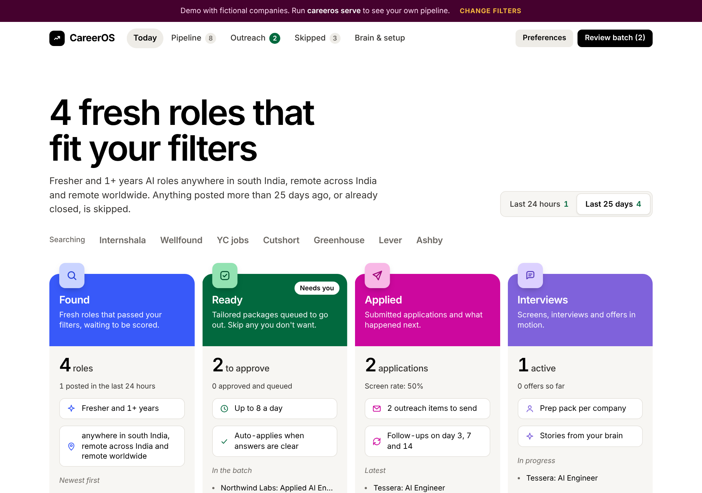
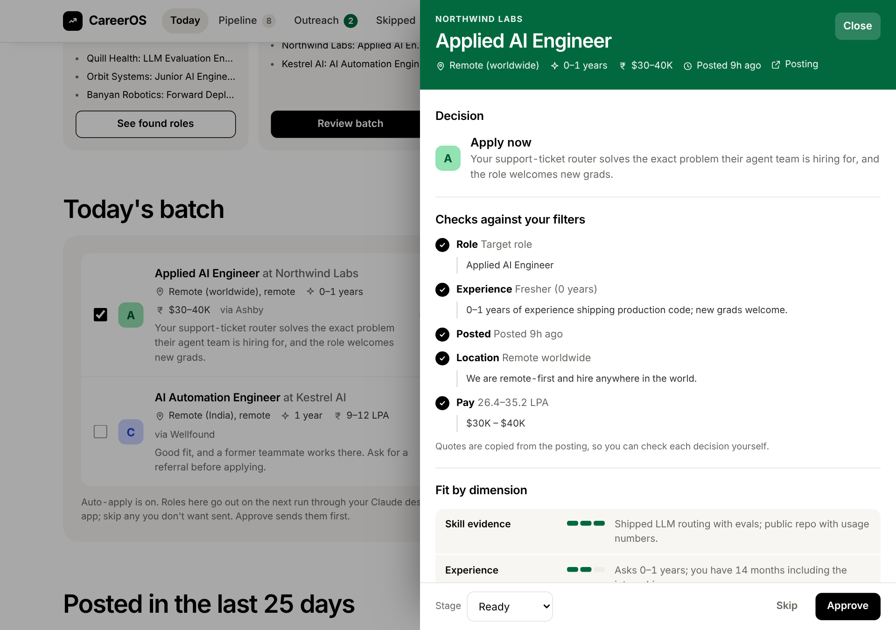
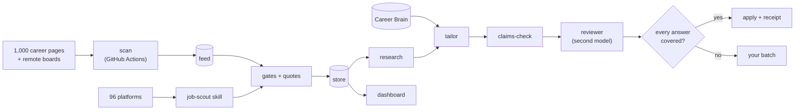

# CareerOS

**An open-source job-application agent that finds fresh roles, checks each one against your filters with quotes from the posting, writes truthful tailored applications, and applies when it can answer every question. Everything else comes to you.**

Built for Claude Code. Works with Codex and Antigravity.



**[Open the live demo](https://vishstack01.github.io/careeros/)** (fictional companies)

---

## Why it's different

Most job bots optimise the weakest variable: volume. They read job cards instead of postings, invent resume lines, guess form answers and sometimes submit twice. CareerOS is built the other way round.

- **Interviews, not application count.** A daily cap, freshness priority, referral-first decisions and honest skips.
- **Evidence, not keywords.** Every resume line cites a claim in your Career Brain. A code gate blocks numbers, tools or projects the brain can't back up.
- **It shows its work.** Every keep or skip records the exact sentence from the posting that decided it.
- **It applies only when it can answer everything.** Each form answer has a confidence. Sensitive fields, essays nobody wrote, captchas and logins go to you.
- **One submit per role, ever.** An idempotent state machine, receipts with screenshots, and a kill switch.
- **Platform-safe.** No LinkedIn or Indeed automation, no account creation, no captcha solving. Outreach is drafted; you send it.
- **Where the openings are first.** About 1,000 Indian product companies' career pages, read straight from their hiring systems every 3 hours, before roles reach the big boards.

## Coverage

| Source | How many | How |
|---|---|---|
| Company career pages | 1,396 product companies: Indian product companies, India engineering centres, the [moreThanFAANGM](https://github.com/Kaustubh-Natuskar/moreThanFAANGM) list, and YC companies in India or hiring remotely | Public feeds of 8 hiring systems (Greenhouse, Lever, Ashby, Workable, SmartRecruiters, Recruitee, Breezy, Personio), scanned every 3 hours on GitHub Actions. [docs/feed.md](docs/feed.md) |
| Remote job boards with feeds | 9 | Remote OK, Remotive, Himalayas, Jobicy, Working Nomads, We Work Remotely, HN jobs, HN "Who is hiring?", Arbeitnow |
| Other platforms | 96 in the registry, 50 low-competition | 26 VC portfolio boards, Indian startup and fresher boards, 11 x-ray searches that find career pages on Keka, Zoho Recruit, Darwinbox and others. [docs/platforms.md](docs/platforms.md) |
| Big boards | LinkedIn, Naukri, Indeed, foundit, Glassdoor, Shine | Their own email alerts only; never automated |

## What it does

| Stage | What happens | How |
|---|---|---|
| Brain | Interviews you and turns your career into claims with evidence | `career-brain` skill, `careeros brain-check` |
| Discover | Scans ~1,000 career pages and 9 remote boards every 3 hours; the agent covers the rest of the 96 platforms | `careeros discover`, `scan`, `filter-feed`, `job-scout` skill |
| Gate | Role, seniority, experience, freshness, open, location, pay, dealbreakers, company; each with a quote | `careeros/gates.py` |
| Research | Company brief, the three problems the team needs solved, fit by dimension, decision A–F | `company-research` skill |
| Tailor | Resume where every bullet cites the brain, cover note, screening answers | `tailor` skill, `careeros claims-check` |
| Review | Independent model checks claims, defensibility, 6-second scan, objections | `reviewer` skill |
| Apply | Fills the company's form, submits only when every required answer is covered | `careeros apply`, `apply` skill |
| Outreach | Hiring-manager, recruiter, LinkedIn and follow-up drafts | `outreach` skill |
| Track & learn | Inbox sync, funnel, skip mining, gap map, weekly experiment | `tracker`, `weekly-review` skills |



## Quick start

```bash
git clone https://github.com/VishStack01/careeros.git && cd careeros
pip install -e ".[browser,dev]" && python -m playwright install chromium
careeros init                    # creates your private config files
careeros scout                   # poll your watchlist, gate every role
careeros discover && careeros scan   # or: build the 1,000-company India feed
careeros serve                   # dashboard at http://127.0.0.1:8765
```

Then open Claude Code in the folder and say *"Use the career-brain skill"* with your resume attached. The full walkthrough, including Codex, Antigravity, cron and a fully hosted setup on claude.ai, is in **[docs/build-your-own.md](docs/build-your-own.md)**.

Try the gates on any posting:

```bash
careeros evaluate --company "Demo Co" --title "Junior AI Engineer" --location "Remote, India" \
  --mode remote --text-file posting.txt
```

## Architecture



Code handles everything with a right answer (dates, experience parsing, dedupe, refusing a second submit); agents handle judgement (interviewing, research, writing, review). Details: **[docs/architecture.md](docs/architecture.md)**.

## Repository map

```
careeros/            Python package (standard library only; Playwright optional)
  sources/           8 hiring-system scouts and 9 remote-board feeds
  discover.py        find each company's job board
  scan.py, feed.py   build the India feed; apply your filters to it
  platforms.py       the job-platform registry and per-run rotation
  extract.py         experience, work mode, remote scope, pay, dates
  gates.py           the gatekeeper
  store.py           SQLite docs, dedupe keys, submit state machine, audit log
  claims.py          resume truth gate
  apply/answers.py   form-answer resolver with confidence
  apply/runner.py    Playwright form filler
  server.py, cli.py  local dashboard API and command line
.claude/skills/      agent skills: career-brain, job-scout, company-research, tailor,
                     reviewer, apply, outreach, tracker, coach, weekly-review
dashboard/           app.html (single source), demo data, built index.html
prompts/             scheduled search and apply prompts
config/companies/    the company list (curated + moreThanFAANGM + YC), 1,396 companies
config/platforms.toml  96 job platforms with access and competition
config/, brain/      example settings, watchlist, profile and brain
examples/            a tailored resume and an application package
docs/                architecture, how it works, accuracy, apply agent, data model, guides
tests/               74 tests, including real browser form fills
```

## Docs

- [How it works, step by step](docs/how-it-works.md)
- [The India feed: 1,000 career pages](docs/feed.md)
- [Job platforms](docs/platforms.md)
- [Architecture](docs/architecture.md)
- [What makes it accurate](docs/accuracy.md)
- [The apply agent](docs/apply-agent.md)
- [Data model](docs/data-model.md)
- [Build your own](docs/build-your-own.md)
- [Responsible use](docs/responsible-use.md)
- [Roadmap](docs/roadmap.md)
- [AGENTS.md](AGENTS.md): instructions for Claude Code, Codex and Antigravity

## Status

Phases 0–4 and 7 of the blueprint are built and tested; learning and interview layers ship as skills. See the [roadmap](docs/roadmap.md).

## Responsible use

It never invents experience or fakes a shortlist percentage, never automates LinkedIn or Indeed, never handles passwords or captchas, and keeps your data in git-ignored files on your machine. Read [docs/responsible-use.md](docs/responsible-use.md) before you schedule it.

## License

MIT. Built by [VishStack](https://github.com/VishStack01) with Claude.
