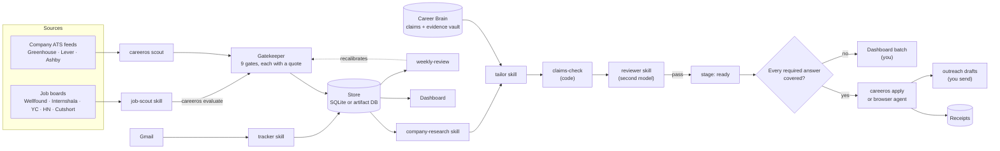
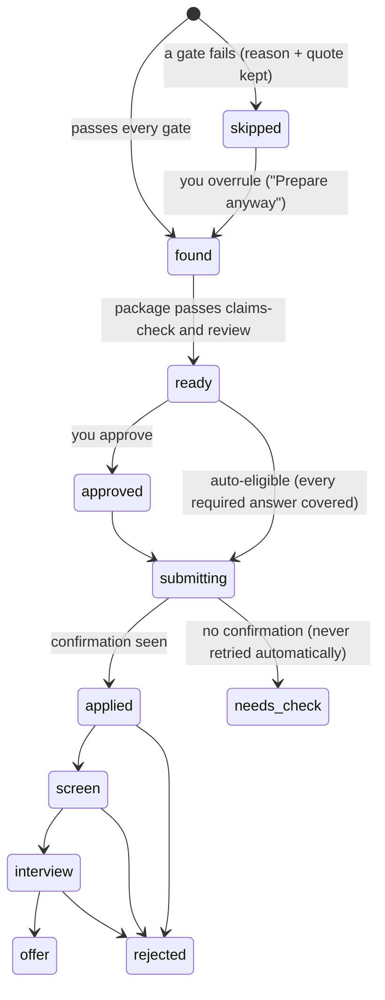
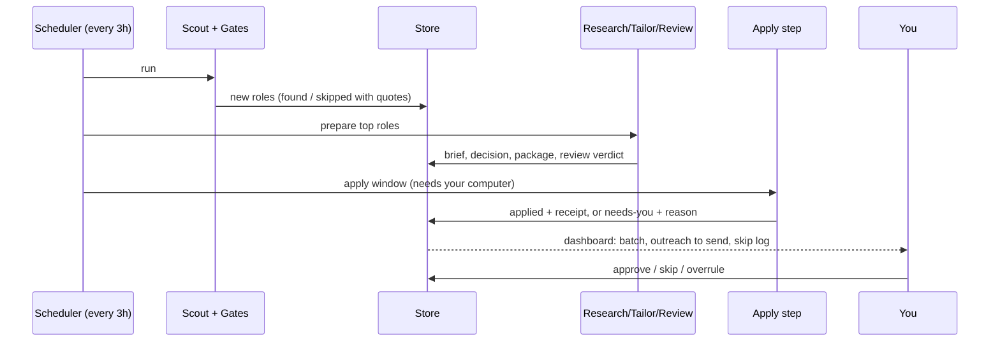

# Architecture

CareerOS splits the work between **code** and **agents** on purpose. Code does
everything that has a right answer (parsing dates, reading experience
requirements, deduping, refusing a second submit). Agents do everything that
needs judgement (interviewing you, researching a company, writing, reviewing).
That split is the main reason it's accurate: the parts a model would get wrong
some of the time are not left to a model.

## Components

| Layer | What it is | Where |
|---|---|---|
| Truth layer | Career Brain (claims, evidence, skills, stories, voice), validated by `brain-check` | `brain/`, `careeros/brain.py` |
| Discovery | ~1,000 company career pages and 9 remote boards scanned every 3 hours on GitHub Actions into a public feed (code); 96 more platforms in rotation (agent) | `careeros/discover.py`, `scan.py`, `feed.py`, `sources/`, `config/platforms.toml`, `job-scout` skill. See [feed.md](feed.md) |
| Gatekeeper | Role, seniority, experience, freshness, open, location, pay, dealbreakers, company | `careeros/gates.py`, `careeros/extract.py`, `careeros/geo.py` |
| State | Documents, dedupe keys, submit state machine, audit log, kill switch | `careeros/store.py` |
| Generation | Research, decision A–F, tailored package | `company-research`, `tailor` skills |
| Verification | Deterministic claims gate + independent model review | `careeros/claims.py`, `reviewer` skill |
| Execution | Answer resolver with confidence + Playwright form filler | `careeros/apply/` |
| Outreach | Drafts only | `outreach` skill |
| Tracking & learning | Inbox sync, funnel, experiments, gap map | `tracker`, `weekly-review` skills |
| Control plane | Dashboard (approvals, skip log, checks with quotes) | `dashboard/app.html`, `careeros serve` |
| Scheduling | Claude scheduled tasks, cron or CI | `prompts/`, `docs/build-your-own.md` |

## Two deployments, one data model

The dashboard reads documents (`jobs/*`, `runs/*`, `settings/profile`,
`brain/status`). The same shapes live in:

- **Hosted**: a Claude artifact with its own database. Scheduled tasks (cloud)
  run the search; a scheduled task on your computer runs the apply step in a
  real browser.
- **Local**: `data/careeros.db` (SQLite). `careeros serve` exposes it to the
  dashboard on `127.0.0.1`; cron runs `careeros scout`.

The dashboard file detects where it is running: inside Claude it uses the
artifact database; served by `careeros serve` it uses the local API; anywhere
else (GitHub Pages) it shows fictional demo data.

## Role lifecycle

The `submitting → applied` step is guarded by the `applications` table: one
row per role (idempotency key = company + canonical URL). A second scheduled
run, a crash or a retry finds the row and refuses to submit again.

## A scheduled cycle

