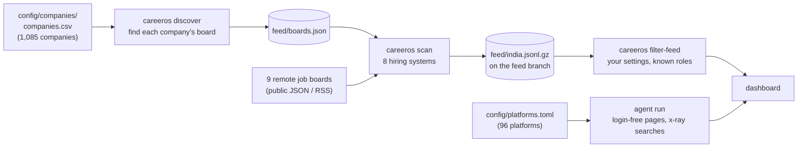

# The India feed: 1,000 career pages every 3 hours

Most openings at Indian product companies never reach a job board, or reach it
days later with hundreds of applicants already in. They are first posted on the
company's own careers page, and most careers pages are a thin skin over a hiring
system (ATS) that publishes every opening as public JSON. CareerOS reads those
feeds directly, for about 1,000 companies, every 3 hours.



## 1. The company list

`config/companies/curated.txt` holds about 800 hand-picked Indian product
companies and India engineering centres, grouped by category: AI-native, dev
tools and infra, SaaS, fintech, consumer, mobility / industrial / climate /
space, global companies hiring engineers in India, remote-first global companies
and more. `scripts/build_company_list.py` merges it with the Y Combinator
directory (active Indian companies plus YC companies hiring remotely) into
`config/companies/companies.csv`: 1,085 companies.

Each line is `Name | aliases | city | ats:token`. The ATS part is optional:
discovery finds it.

## 2. Discovery: which hiring system does each company use?

`careeros discover` tries each company's likely board names (its name, aliases
and website domain, slugified) on eight hiring systems, most common first:
Greenhouse, Lever, Ashby, Workable, SmartRecruiters, Recruitee, Breezy and
Personio. A board counts only if it checks out:

- the board's own company name matches ours, when the feed reports one;
- for India-headquartered companies, at least one opening is in India or remote
  (a board full of US roles under the same name is usually a different company).

Results are cached in `feed/boards.json`. Companies whose careers page runs on a
system without a public feed (Darwinbox, Keka, Zoho Recruit, Freshteam, custom
pages) are listed in `feed/unmapped.csv`; the agent visits about ten of them per
run in rotation. Discovery re-checks unmapped companies every 14 days and boards
that errored on the next run, at most 400 companies per run, about 4 requests a
second per hiring system.

## 3. The scan

`careeros scan` reads every mapped board plus nine remote job boards with
public feeds (Remote OK, Remotive, Himalayas, Jobicy, Working Nomads, We Work
Remotely, Hacker News jobs, HN "Who is hiring?", Arbeitnow). It keeps tech
roles that are in India or remote and, for each, extracts the facts the gates
need from the **full** posting once: minimum years (highest figure wins,
nice-to-haves ignored), whether freshers are welcome, who can apply to a remote
role, pay in LPA, closed notices and applicant counts. Each fact keeps the
sentence it came from.

When a remote board re-lists a role that is also on the company's own board, the
company's posting wins. Boards that ask for gentle polling are respected:
Remotive is read every 6 hours, Jobicy at most hourly.

Output, published to the `feed` branch by `.github/workflows/scan.yml`:

| File | What |
|---|---|
| `feed/india.jsonl.gz` | one open role per line, with facts and a 1,500-character summary |
| `feed/summary.json` | counts by system and region, errors, boards that failed this scan |
| `feed/boards.json` | each company's hiring system and board name |
| `feed/unmapped.csv` | companies whose careers page has no public feed |

The feed is a public list of openings. It holds nothing about you.

## 4. Your filters

`careeros filter-feed` runs the same gates as everything else, using your
dashboard settings, and skips roles you already have (same URL, or same company
and title). It writes ready-to-store dashboard documents:

- `kept/`: roles that pass every gate, ordered remote worldwide → remote India →
  south India, newest first;
- `skipped/`: near-misses that fail exactly one gate (experience, posting age,
  location, pay or seniority), with what would change the decision;
- `index.json`: counts, plus `gone` (roles on your dashboard whose board was
  read successfully and no longer lists them, so they closed) and `expired`
  (roles posted before your window).

The scheduled agent run spot-checks roles whose remote eligibility or
experience the posting leaves unclear, writes the rest, then spends its own
budget on the platforms the feed can't read (see [platforms.md](platforms.md)).

## Running it yourself

Fork the repo and enable Actions: the `scan` workflow runs every 3 hours on
GitHub's free runners and publishes your fork's `feed` branch. Or run it locally:

```bash
careeros discover            # first run: ~30 minutes for 1,085 companies
careeros scan                # a few minutes
careeros filter-feed --feed feed/india.jsonl.gz --settings config/settings.toml --out new
```

GitHub pauses scheduled workflows in repositories with no activity for 60 days;
re-enable it from the Actions tab if that happens.

## Adding companies

Add a line to `config/companies/curated.txt` and run
`python scripts/build_company_list.py`. If you know the board (for example
`ats:lever:acme`), add it; otherwise discovery finds it. Pull requests welcome.
